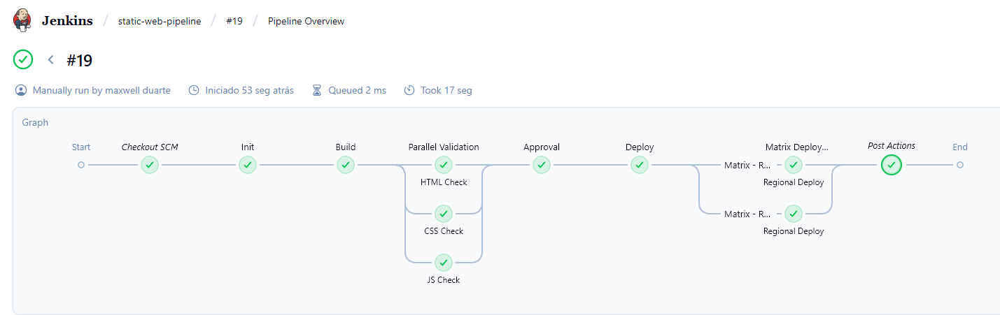

# Jenkins Static Experience

## 1. Objetivo
Este projeto demonstra um pipeline completo de CI/CD declarativo desenvolvido no Jenkins, com foco em boas práticas de automação, versionamento e entrega contínua. A pipeline foi construída passo a passo com testes locais em ambiente Docker e executada via Jenkinsfile.

O objetivo é criar um pipeline funcional que inclua todos os principais recursos do Jenkins Declarative Pipeline, conforme solicitado na disciplina de CI/CD:

- Agent
- Environment
- Options
- Parameters
- Triggers
- Steps
- Input
- Conditions
- Credentials
- Parallel Stages
- Matrix
- Post Actions

---

## 2. Arquitetura da Pipeline
A pipeline executa um ciclo completo de build e deploy para um site estático, simulando um fluxo real de produção:

1. Checkout do código no GitHub  
2. Build local dos arquivos do site (index.html, style.css, script.js)  
3. Validação paralela de HTML, CSS e JS  
4. Aprovação manual antes da publicação  
5. Deploy condicional com uso de credenciais seguras  
6. Deploy distribuído via matrix (múltiplas regiões simultâneas)  
7. Post actions de sucesso e falha  

---

## 3. Estrutura do Jenkinsfile
Resumo dos blocos principais e suas funções:

| Bloco | Função | Exemplo de Uso |
|--------|--------|----------------|
| agent | Define onde a pipeline será executada | agent any |
| environment | Define variáveis globais reutilizáveis | APP_NAME, BUILD_ENV, AUTHOR |
| options | Controla comportamento de execução e logs | timestamps(), disableConcurrentBuilds() |
| parameters | Permite interação antes do build | Escolha de branch, modo de deploy, validação |
| triggers | Automatiza execuções com base em tempo ou SCM | pollSCM('H/30 * * * *') |
| stages / steps | Define as etapas principais de execução | Build, Validate, Deploy, Matrix Deploy |
| input | Pausa o pipeline aguardando aprovação manual | Do you want to deploy this build? |
| when / conditions | Controla execução condicional de stages | Deploy apenas se DEPLOY_MODE == 'production' |
| credentials | Usa valores seguros armazenados no Jenkins | withCredentials(...) |
| parallel | Executa múltiplas validações simultaneamente | HTML Check, CSS Check, JS Check |
| matrix | Executa deploy em múltiplas regiões | us-east-1, eu-west-1 |
| post | Executa ações após o pipeline | Mensagens de sucesso ou erro |

---

## 4. Stages do Pipeline

### Init
Exibe informações iniciais e parâmetros selecionados.

### Build
Cria a pasta `build/` e copia os arquivos do site.

### Parallel Validation
Valida os arquivos principais (HTML, CSS, JS) em paralelo.

### Approval
Simula aprovação manual antes do deploy.

### Deploy
Executa a publicação apenas se o `DEPLOY_MODE` for `production`, usando credencial segura.

### Matrix Deploy Simulation
Executa deploy em paralelo para múltiplas regiões (`us-east-1`, `eu-west-1`).

### Post Actions
Executa ao final, registrando status de sucesso ou falha.

---

## 5. Credenciais
O pipeline utiliza credenciais simuladas para representar um processo seguro de deploy. No Jenkins, foi criada a credencial com os seguintes dados:

- ID: fake-deploy-token  
- Tipo: Secret Text  
- Valor: FAKE-TOKEN-12345

---

## 6. Tecnologias utilizadas
- Jenkins LTS (JDK17) via Docker Compose  
- Blue Ocean Plugin para visualização gráfica  
- Pipeline: Stage View  
- GitHub (SCM)  
- Shell Script (Linux / WSL)

---

## 7. Resultados
- Todos os 12 requisitos implementados  
- Pipeline funcional e testável localmente via Docker  
- Execução automatizada com triggers SCM  
- Logs organizados e com timestamps  
- Estrutura modular e pronta para CI/CD real

---

## 8. Próximos passos
1. Adicionar screenshots da pipeline (Stage View / Blue Ocean)  

### Gráfico de excução completa


### Log de excução 

````
=== Jenkins Pipeline Execution Summary ===

Pipeline: Jenkins Static Experience
Branch: main
Deploy mode: production
Validation: enabled

-------------------------------------------------------
[Init]
Starting jenkins-static-experience build
Branch selected: main
Deploy mode: production
Validation enabled: true

[Build]
Building static site...
Build folder created successfully!

[Parallel Validation]
HTML Check: ✅ passed
CSS Check: ✅ completed
JS Check: ✅ finished

[Approval]
Input requested: Do you want to deploy this build?
Approved by: maxwell duarte

[Deploy]
Starting deployment to production environment...
Uploading build folder to simulated server...
Using deploy key: ****
Deployment to production completed successfully!

[Matrix Deploy Simulation]
Deploying to region: us-east-1
Connecting to simulated server...
Deployment to us-east-1 completed successfully!

Deploying to region: eu-west-1
Connecting to simulated server...
Deployment to eu-west-1 completed successfully!

-------------------------------------------------------
Pipeline finished successfully!
Status: SUCCESS
-------------------------------------------------------

````

---

## 9. Autor
Projeto desenvolvido por **Maxwell Duarte**  
Pós-graduação em DevOps — PUC Minas
